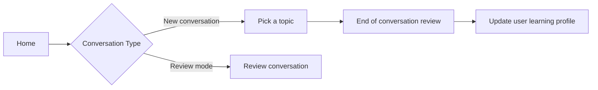

# Language Learning App — App-Level Context

> This file defines the product's core concepts, user flow, and terminology.
> It is the shared reference for all sub-projects (frontend, backend).
> Implementation details belong in frontend @frontend/CLAUDE.md and backend @backend/CLAUDE.md.

---

## What This App Does

An AI-powered English conversation practice app for Mandarin Chinese native speakers.
The main features of this app:
* Provides a highly personalized conversation experience, similar to talking to a real tutor. It can memorize conversation history and adjust its communication style based on the user's level.
* It reviews parts where the user didn't express themselves well in previous sessions, helping users consciously practice areas where they're not yet fluent. (e.g. Proactive learning)

---

## User Flow

**Node descriptions:**
- **Home**: Two tabs — conversation and profile. Profile shows the user's latest learning progress.
- **Pick a topic**: User picks a topic or starts a casual chat.
- **End of conversation review**: AI points out sentences where the user needs to improve.
- **Review conversation**: AI retrieves previous errors made by the user and acts as a tutor to help them practice.
- **Update user learning profile**: Saves learning progress after each session.

---

* Each new conversation must bring relevant chat history into context. The AI needs to remember previous conversation topics. Relevant chat history is defined as history from conversations on the same topic.
* After each conversation, the app needs to record the user's incorrect sentences, as well as a summary of the chat including the topic.